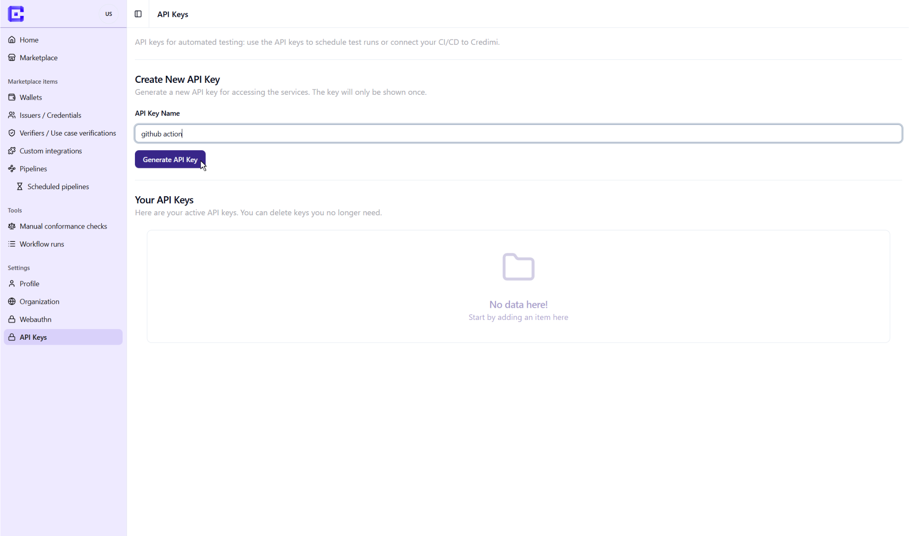
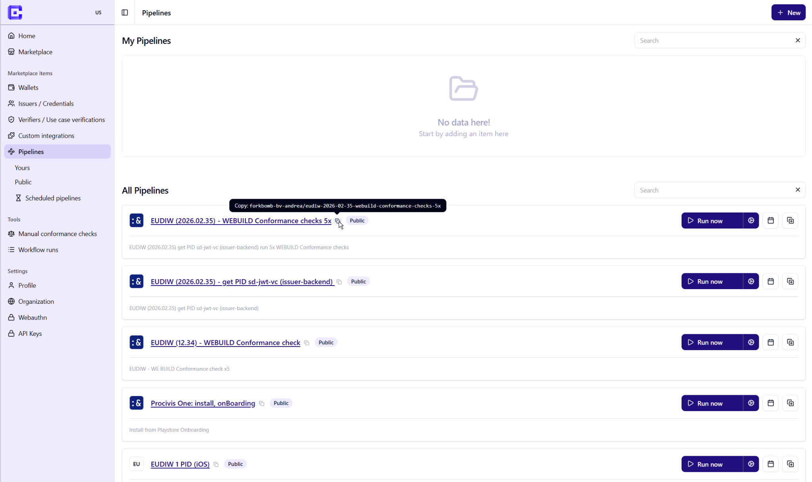

<div align="center">
<h1>
  redimi Test Action
</h1>

### Run [Credimi](https://github.com/ForkbombEu/credimi) pipelines from GitHub Actions to test wallets as part of your CI workflow. <!-- omit in toc --> 
<!--, credential issuers, and verifiers-->
</div>

<br>

This action starts a Credimi pipeline execution and passes GitHub workflow metadata to Credimi so runs can be traced back to the repository, workflow, commit, and pull request that triggered them. It helps teams validate identity and credential flows automatically instead of relying only on manual QA. You can use this action to:
- Test mobile apps built in CI using the same **automation pipeline(s)** on every pull request.
- **Pinpoint bugs** and failures to the exact commit, **through the pipeline run(s)**  output.
<!--- Check issuer and verifier behavior against reusable Credimi pipelines.-->

<br>

---

<div id="toc">

### 🚩 Table of contents <!-- omit in toc -->

- [🏗️ Setup](#️-setup)
  - [🔐 Credimi API key](#-credimi-api-key)
  - [🔗 Choose a pipeline](#-choose-a-pipeline)
- [🎮 Usage](#-usage)
  - [📂 Test a locally built APK](#-test-a-locally-built-apk)
  - [🌐 Test an APK by URL](#-test-an-apk-by-url)
- [⌨️ Inputs](#️-inputs)
- [🥷 Advanced usage](#-advanced-usage)
  - [👟 Choose specific runners](#-choose-specific-runners)
  - [➕ Add or exclude specific runs](#-add-or-exclude-specific-runs)
  - [📡 Use a custom API base URL](#-use-a-custom-api-base-url)
- [🗞️ More information](#️-more-information)

</div>

---
## 🏗️ Setup

Follow these steps:

1. Install the [<span style="font-weight: 1000;">Credimi CI GitHub App<span>](https://github.com/apps/credimi-ci/installations/new).
2. Create your [Credimi API key](https://credimi.io/my/profile/api-keys) and add it to GitHub as a repository or organization secret named `CREDIMI_API_KEY`.
3. Create or choose one or more [Credimi pipelines](https://credimi.io/my/pipelines) and copy its/their identifiers (formatted as `org/pipeline`).

### 🔐 Credimi API key

Log in to Credimi and visit the [Credimi API key page](https://credimi.io/my/profile/api-keys).
After you create a new key, save it in your GitHub organization or repository secrets under the name `CREDIMI_API_KEY`.

<div align=center>

</div>

### 🔗 Choose a pipeline

Log in to Credimi and visit the [Credimi pipeline page](https://credimi.io/my/pipelines).
Find the pipeline you want to run in CI, then click the copy button next to its name.
This copies the pipeline identifier that you will use in the `pipeline-ids` input.

<div align=center>

</div>

**[🔝 back to top](#toc)**

---
## 🎮 Usage

### 📂 Test a locally built APK

```yaml
name: Credimi tests

on:
  pull_request:
    branches: [main]

jobs:
  credimi:
    runs-on: ubuntu-latest
    steps:
      - uses: actions/checkout@v6

      # Build your APK before running Credimi.
      # Replace this with your project build command.
      - run: ./gradlew assembleDebug

      - uses: forkbombeu/credimi-test-action@main
        with:
          api-key: ${{ secrets.CREDIMI_API_KEY }}
          pipeline-ids: |
            your-org/your-pipeline
            your-org/another-pipeline
          runner-types: |
            android_emulator
          apk-file: path/to/your/app.apk
```

This example starts two runs:
- `your-org/your-pipeline` on runner of type `android_emulator`
- `your-org/another-pipeline` on runner of type `android_emulator`

### 🌐 Test an APK by URL

```yaml
name: Credimi tests

on:
  workflow_dispatch:

jobs:
  credimi:
    runs-on: ubuntu-latest
    steps:
      - uses: forkbombeu/credimi-test-action@main
        with:
          api-key: ${{ secrets.CREDIMI_API_KEY }}
          pipeline-ids: |
            your-org/your-pipeline
            your-org/another-pipeline
          runner-types: |
            android_emulator
            redroid
          apk-url: https://example.com/path/to/app.apk
```

This example starts **4 pipeline runs**:

1. `your-org/your-pipeline` on runner of type `android_emulator`
1. `your-org/another-pipeline` on runner of type `android_emulator`
1. `your-org/your-pipeline` on runner of type `redroid` 
1. `your-org/another-pipeline` on runner of type `redroid`


**[🔝 back to top](#toc)**

---
## ⌨️ Inputs

| Input          | Required | Description                                                        |
| -------------- | -------- | ------------------------------------------------------------------ |
| `api-key`      | Yes      | Credimi API key. Store it as a GitHub Actions secret.              |
| `pipeline-ids` | Yes      | Newline-separated Credimi pipeline identifiers, for example `your-org/your-pipeline`. |
| `runner-types` | No       | Newline-separated runner types. One of `android_emulator`, `redroid`, `android_phone`, `ios_simulator`. |
| `runner-ids`   | No       | Newline-separated specific runners formatted as `<runner-id>/<runner-type>`. |
| `extra-runs`   | No       | Newline-separated runs to add, formatted as `<pipeline-id> <runner-type>` or `<pipeline-id> <runner-id>/<runner-type>`. |
| `exclude-runs` | No       | Newline-separated runs to remove, using the same format as `extra-runs`. Exclusions match exact runs. |
| `apk-file`     | No       | Path to a locally built APK artifact in the workflow workspace.    |
| `apk-url`      | No       | URL where Credimi can fetch the APK.                               |
| `api-base-url` | No       | Credimi API base URL. Defaults to `https://credimi.io`.            |

Exactly one of `apk-file` or `apk-url` must be provided.
Exactly one of `runner-types` or `runner-ids` must be provided.

The action first builds the cartesian product of `pipeline-ids` and either `runner-types` or `runner-ids`.
Then it adds `extra-runs`, removes `exclude-runs`, and sends one request to Credimi for each remaining run.

**[🔝 back to top](#toc)**

---
## 🥷 Advanced usage

### 👟 Choose specific runners

By default, Credimi selects an available runner that matches each requested `runner-types` entry. If you need to run pipelines on specific runners, use `runner-ids` instead.

Each `runner-ids` line must end with the runner type: `<runner-id>/<runner-type>`.

```yaml
- uses: forkbombeu/credimi-test-action@main
  with:
    api-key: ${{ secrets.CREDIMI_API_KEY }}
    pipeline-ids: |
      your-org/your-pipeline
      your-org/another-pipeline
    runner-ids: |
      your-org/your-runner/android_phone
      your-org/another-runner/redroid
    apk-url: https://example.com/path/to/app.apk
```

This starts one run for each pipeline and each listed specific runner.

### ➕ Add or exclude specific runs

Use `extra-runs` to add runs outside the generated cartesian product. Use `exclude-runs` to remove exact runs after extras are added.

```yaml
- uses: forkbombeu/credimi-test-action@main
  with:
    api-key: ${{ secrets.CREDIMI_API_KEY }}
    pipeline-ids: |
      your-org/your-pipeline
      your-org/another-pipeline
    runner-types: |
      android_emulator
      redroid
    extra-runs: |
      your-org/your-pipeline your-org/your-runner/android_phone
    exclude-runs: |
      your-org/another-pipeline redroid
    apk-url: https://example.com/path/to/app.apk
```

In this example, the action starts the generated pipeline/runner-type combinations, adds one specific phone run, and removes the `another-pipeline` run on `redroid`.

### 📡 Use a custom API base URL

The action sends requests to `https://credimi.io` by default. Use `api-base-url` only when you need to target another Credimi environment, such as a staging or self-hosted instance.

```yaml
- uses: forkbombeu/credimi-test-action@main
  with:
    api-key: ${{ secrets.CREDIMI_API_KEY }}
    pipeline-ids: |
      your-org/your-pipeline
    runner-types: |
      android_emulator
    api-base-url: https://credimi.example.com
    apk-url: https://example.com/path/to/app.apk
```

**[🔝 back to top](#toc)**

---
## 🗞️ More information

- Credimi project: https://github.com/ForkbombEu/credimi
- Credimi CI app installation: https://github.com/apps/credimi-ci/installations/new

**[🔝 back to top](#toc)**
